# Progopdrachten M6

## Opdracht 1 / Code Conventions

[Script/Code](https://github.com/CracksEvry/Progopdrachten/tree/main/Assets/Scripts/M6/Code%20Conventions)


## Opdracht  2 / Class diagram Towerdefense

```mermaid

classDiagram

class Bullet {
    - int damage
    - float lifeTime
    + Start()
    + OnTriggerEnter2D(collider)
}

class Enemy {
    - int health
    - int cashReward
    - spriteRenderers
    - Transform visuals
    + TakeDamage(dmg)
    + KillEnemy()
    + FlashEffect()
}

Bullet --> Enemy : interacts with


class EnemySpawner {
    - enemyTypes[]
    - baseEnemies
    - enemiesPerSecond
    - maxWaves
    - currentWave
    + SpawnEnemy()
    + EnemyDestroyed()
    + IsAllWavesDone()
}

class EnemyType {
    - GameObject prefab
    - spawnWeight
    - minSpeed
    - maxSpeed
    - weightIncreasePerWave
}

EnemySpawner --> EnemyType : spawns


class Enemymovement {
    - Rigidbody2D rb
    - float moveSpeed
    - int health
    - target
    - PathIndex
    + TakeDamage(dmg)
}

class StraightEnemy {
    - Rigidbody2D rb
    - moveSpeed
    - target
    - pathIndex
    + SetSpeed()
}

class ZigZagEnemy {
    - zigzagAmplitude
    - zigzagFrequency
    - float time
    + SetSpeed()
}

StraightEnemy --> Enemymovement
ZigZagEnemy --> Enemymovement


class Turret {
    - range
    - fireRate
    - bulletPrefab
    - firePoint
    - bulletSpeed
    - turnSpeed
    - target
    + Update()
    + Shoot()
    + EnemyLockOn()
}

Turret --> Bullet : shoots


class PlayerShoot {
    - shootingPoint
    - bulletPrefab
    - bulletSpeed
    - bulletCooldown
    - spreadAngle
    + Shoot(dir)
    + ApplySpread(dir)
    + GetMouseDirection()
}

PlayerShoot --> Bullet : spawns


class PopupSpawner {
    - popupPrefab
    - Transform player
    + SpawnPopup(msg)
}

class PopupText {
    - TMP_Text text
    + Show(msg)
}

PopupSpawner --> PopupText


class ScreenFlash {
    - Image flashImg
    + Flash()
}

class UIManager {
    - Image redPanel
    - popupPrefab
    - playerTransform
    + RedFlash()
    + ShowPopup(text)
    + Fade()
    + Slide()
}


class CashSystem {
    - int cashAmount
    - TMP cashText
    + AddCash()
    + SpendCash()
}


class TurretBuildManager {
    + PlaceTurret(prefab,pos)
}

class TurretDragUI {
    - turretPrefab
    - turretCost
    + OnBeginDrag()
    + OnDrag()
    + OnEndDrag()
}

TurretDragUI --> TurretBuildManager : uses


class SoundManager {
    - sfxSource
    - musicSource
    - clips
    + PlayShoot()
    + PlayPlaceTower()
    + PlayBackgroundMusic()
}


class LevelManager {
    - lives
    - Path[]
    - Healthbar
    - gameOverUI
    + LoseLife()
    + GameOver()
    + RestartLevel()
    + LoadMainMenu()
}


class CamShake {
    + Shake(duration,strength)
}

class CameraDrag {
    - panSpeed
    - bounds
    - useBounds
    + StartDrag()
    + ContinueDrag()
    + EndDrag()
}

class EndlessRunner {
    - vbegin
    - g
    - velocity
    - acceleration
    - State enum
    - t
    - tmax
}

class Shooting {
    - lifetime
}

class Background {
    - Renderer bgBackground
    - speed
}

class SceneSwitcher {
    - nextSceneName
    - spawner
}


	

	

```




## Opdracht 3 / Data Structures

[Script/Code](https://github.com/CracksEvry/Progopdrachten/tree/main/Assets/Scripts/M6/Data%20Structure)

## Opdracht 4 / delegates gebruiken


[Delgates](Assets/Scripts/M6/Delegates)

```Charp
public bool IsPlayerReadyToAttack(Player player)
{

        if (player == null) return false;
        if (!player.IsAlive) return false;
        if (player.AttackCooldown > 0) return false; 
        if (player.Target == null) return false;

        if (!player.Target.IsAlive) return false;

   
    if (Vector3.Distance(player.transform.position, player.Target.transform.position) >= 5f)
    {
        return false;
    }

    bool hasManaAndWeapon
        if (player.Mana >= 20 && player.HasEquippedWeapon("Sword"))
    hasManaAndWeapon = true;
    
    bool hasHealthAndBuff
        if (player.Health >= 50 && player.HasActiveBuff("Berserk"))
        hasHealthAndBuff = true;

        if (!hasManaAndWeapon || !hasHealthAndBuff)
        
     return true;
    


}
```

## Opdracht 5 / Abstractions


[Script/Code](https://github.com/CracksEvry/Progopdrachten/tree/main/Assets/Scripts/M6/Abstraction)


## Opdracht 6 / Polymorfisme


[Script/Code](https://github.com/CracksEvry/Progopdrachten/tree/main/Assets/Scripts/M6/Polymorfisme)