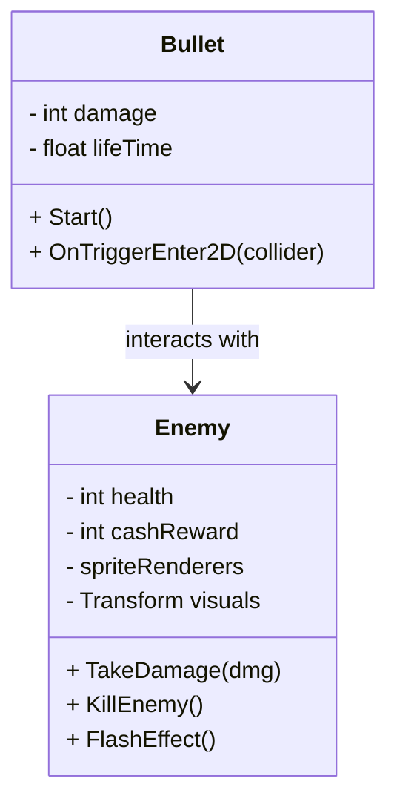

# Progopdrachten M6

## Opdracht 1 / Code Conventions

[Script/Code](https://github.com/CracksEvry/M6_PROG_CS/tree/main/Assets/Scripts/M6/Code%20Conventions)


## Opdracht  2 / Class diagram Towerdefense




## Opdracht 3 / Data Structures

[Script/Code](https://github.com/CracksEvry/M6_PROG_CS/tree/main/Assets/Scripts/M6/Data%20Structure)

## Opdracht 4 / delegates gebruiken


[Delgates](https://github.com/CracksEvry/M6_PROG_CS/tree/main/Assets/Scripts/M6/Delegates)

```Charp
public bool IsPlayerReadyToAttack(Player player)
{

        if (player == null) return false;
        if (!player.IsAlive) return false;
        if (player.AttackCooldown > 0) return false; 
        if (player.Target == null) return false;

        if (!player.Target.IsAlive) return false;

   
    if (Vector3.Distance(player.transform.position, player.Target.transform.position) >= 5f)
    {
        return false;
    }

    bool hasManaAndWeapon
        if (player.Mana >= 20 && player.HasEquippedWeapon("Sword"))
    hasManaAndWeapon = true;
    
    bool hasHealthAndBuff
        if (player.Health >= 50 && player.HasActiveBuff("RageMode"))
        hasHealthAndBuff = true;

        if (!hasManaAndWeapon || !hasHealthAndBuff)
        
     return true;
    


}
```

## Opdracht 5 / Abstractions


[Script/Code](https://github.com/CracksEvry/M6_PROG_CS/tree/main/Assets/Scripts/M6/Abstraction)


## Opdracht 6 / Polymorfisme


[Script/Code](https://github.com/CracksEvry/M6_PROG_CS/tree/main/Assets/Scripts/M6/Polymorfisme)


## Opdracht 7 / Early Returns

![kajsndkansd]